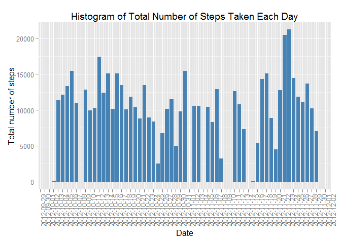
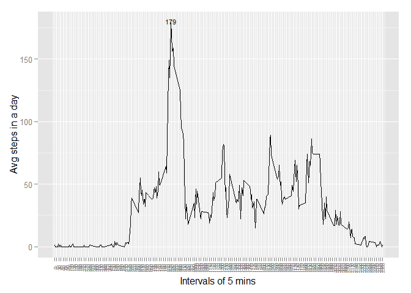
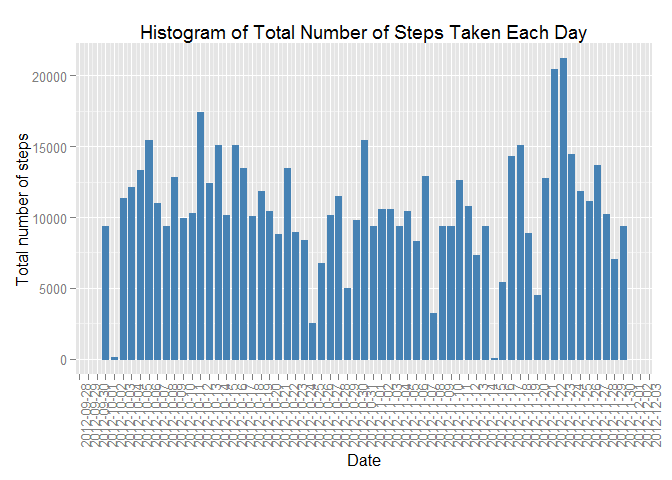
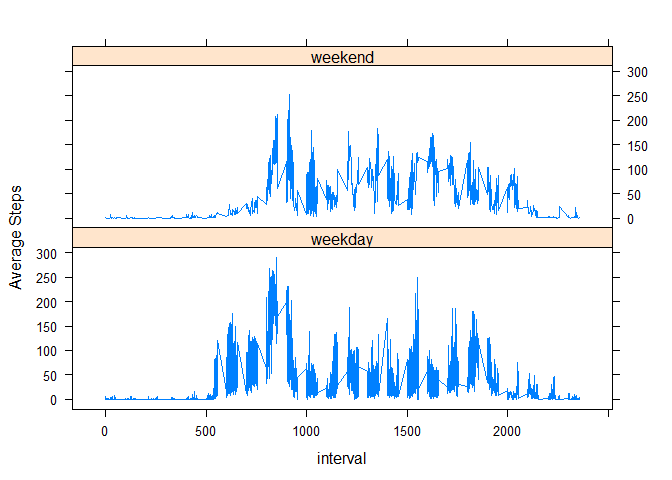

# Reproducible Research: Peer Assessment 1
*Activity Monitoring data*  

***

##Loading and preprocessing the data

```r
if(!file.exists('activity.csv')){
    unzip('activity.zip')
}
activity <- read.csv("activity.csv",sep=",",header=TRUE,stringsAsFactors = FALSE)
head(activity)
```

```
##   steps       date interval
## 1    NA 2012-10-01        0
## 2    NA 2012-10-01        5
## 3    NA 2012-10-01       10
## 4    NA 2012-10-01       15
## 5    NA 2012-10-01       20
## 6    NA 2012-10-01       25
```

```r
activity$date<-as.Date(activity$date)
```

##What is mean total number of steps taken per day?

- Calculating Total number of steps per day

```r
stepsperday<-tapply(activity$steps,activity$date,sum,na.omit=TRUE)
library(reshape2)
```

```
## Warning: package 'reshape2' was built under R version 3.1.3
```

```r
Sdays<-melt(stepsperday,id= "date")
names(Sdays)[1]<- "date"
names(Sdays)[2]<- "steps"
Sdays$date<-as.Date(Sdays$date)
#Sdays contains the total number of steps taken each day
```

- Histogram of the total number of steps taken each day

```r
library(ggplot2)
```

```
## Warning: package 'ggplot2' was built under R version 3.1.3
```

```r
ggplot(Sdays, aes(date, steps)) + 
geom_histogram(stat = "identity", colour = "steelblue", fill = "steelblue", width = 0.7) +
        labs(title = "Histogram of Total Number of Steps Taken Each Day", 
             x = "Date", y = "Total number of steps")+
        scale_x_date(breaks = "days")+
        theme( axis.text.x  = element_text(angle=90))
```

```
## Warning: Removed 8 rows containing missing values (position_stack).
```

 

- Mean and median of the total number of steps taken per day

```r
mean1<-mean(Sdays$steps,na.rm = TRUE)      
median1<-median(Sdays$steps,na.rm = TRUE)
```

*Average steps taken per day is 1.0767189\times 10^{4} and the meadian is 10766.*

##What is the average daily activity pattern?


```r
#Getting the average across all days for each 5 minute interval
avgsteps <- tapply(activity$steps,list(activity$date,activity$interval),sum)
interval_steps<-colSums(avgsteps,na.rm = TRUE)
interval_activity<-data.frame(interval=as.numeric(names(interval_steps)),
                           steps=as.numeric(interval_steps))

for(i in 1:nrow(interval_activity)){
        interval_activity$avgSteps[i] <- round(interval_activity$steps[i]/61,0)
}
#The column avgSteps has the average value for each 5 minute interval
```
- Time series plot (i.e. type = "l") of the 5-minute interval (x-axis) and the average number of steps taken, averaged across all days (y-axis)

```r
ggplot(interval_activity, aes(interval,avgSteps)) + geom_line() +
        xlab("Intervals of 5 mins") + ylab("Avg steps in a day")+
        scale_x_continuous(breaks=seq(0,2355,15))+
        theme( axis.text.x  = element_text(angle=90, vjust=0.5,size = 5))+
        annotate("text",label="179",vjust=0.2,x=835,y=179,size=3)
```

 

- Which 5-minute interval, on average across all the days in the dataset,contains the maximum number of steps?

```r
interval_activity[interval_activity$avgSteps== max(interval_activity$avgSteps),]
```

```
##     interval steps avgSteps
## 104      835 10927      179
```

##Imputing missing values
- Total number of missing values in the dataset 

```r
sum(is.na(activity))
```

```
## [1] 2304
```
- Strategy for filling in all of the missing values in the dataset
*The strategy used here is to fill in the NA's with the average of the 5 minute interval across all days*
- New dataset that is equal to the original dataset but with the missing data filled in

```r
activity_new <- activity
for (i in 1:nrow(activity_new)){
        
        if(is.na(activity_new$steps[i])){

            activity_new$steps[i] <- interval_activity[which(activity_new$interval[i]==interval_activity$interval),]$avgSteps   
        }
}
sum(is.na(activity_new))
```

```
## [1] 0
```

```r
head(activity_new)
```

```
##   steps       date interval
## 1     1 2012-10-01        0
## 2     0 2012-10-01        5
## 3     0 2012-10-01       10
## 4     0 2012-10-01       15
## 5     0 2012-10-01       20
## 6     2 2012-10-01       25
```
- Histogram of the total number of steps taken each day(with new dataset)

```r
N_stepsperday<-tapply(activity_new$steps,activity_new$date,sum)
library(reshape2)
newSdays<-melt(N_stepsperday,id= "date")
names(newSdays)[1]<- "date"
names(newSdays)[2]<- "steps"
newSdays$date<-as.Date(newSdays$date)

ggplot(newSdays, aes(date, steps)) + 
        geom_histogram(stat = "identity", colour = "steelblue", fill = "steelblue", width = 0.7)+
        labs(title = "Histogram of Total Number of Steps Taken Each Day", 
             x = "Date", y = "Total number of steps")+
        scale_x_date(breaks = "days")+theme( axis.text.x  = element_text(angle=90))
```

 

- Mean and median total number of steps taken per day(with new dataset)

```r
mean2<-mean(newSdays$steps)      
median2<-median(newSdays$steps)
```

*The new mean and median are 1.0580721\times 10^{4} and 1.0395\times 10^{4}.*

##Do these values differ from the estimates from the first part of the assignment? 

```r
diff1<-mean(Sdays$steps,na.rm = TRUE)- mean(newSdays$steps)  
diff2<-median(Sdays$steps,na.rm = TRUE)-median(newSdays$steps)
```

* Impact of imputing missing data is that the new mean differ by 186.4673678 and the new median differ by 371 *

##Are there differences in activity patterns between weekdays and weekends?
- Create a new factor variable in the dataset with two levels "weekday" and "weekend" indicating whether a given date is a weekday or weekend day

```r
#new day column
activity_new$day <- weekdays(activity_new$date)

#levels(activity_new$day)<-list(weekday = c("Monday", "Tuesday",
 #                                          "Wednesday", 
  #                                         "Thursday", "Friday"),
   #                            weekend = c("Saturday", "Sunday"))

N_avgsteps <- tapply(activity_new$steps,list(activity_new$day,activity_new$interval),mean)

avgweekday<-melt(N_avgsteps,id="day")
names(avgweekday)[1]<- "day"
names(avgweekday)[2]<- "interval"
levels(avgweekday$day)<-list(weekday = c("Monday", "Tuesday",
                                           "Wednesday", 
                                           "Thursday", "Friday"),
                               weekend = c("Saturday", "Sunday"))
#introducing factor levels of weekday and weekend
```
- Panel plot containing a time series plot (i.e. type = "l") of the 5-minute interval (x-axis) and the average number of steps taken, averaged across all weekday days or weekend days (y-axis)

```r
library(lattice)
xyplot(value~interval|day,data = avgweekday,type="l",layout = c(1, 2),ylab="Average Steps")
```

 


